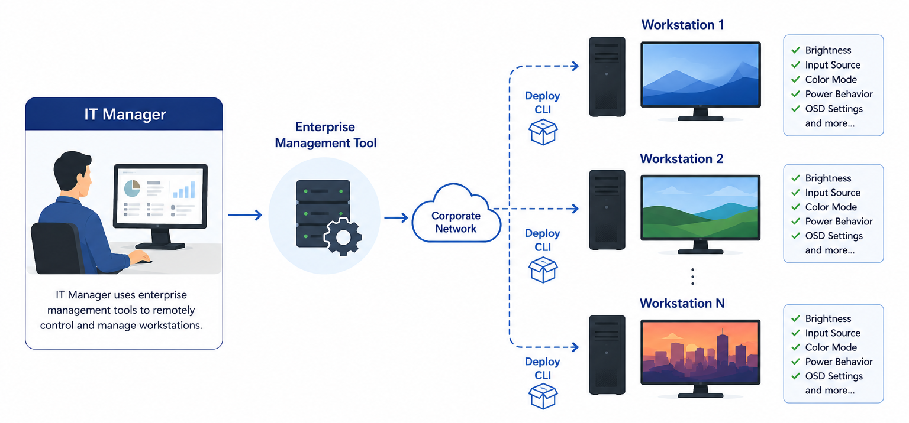
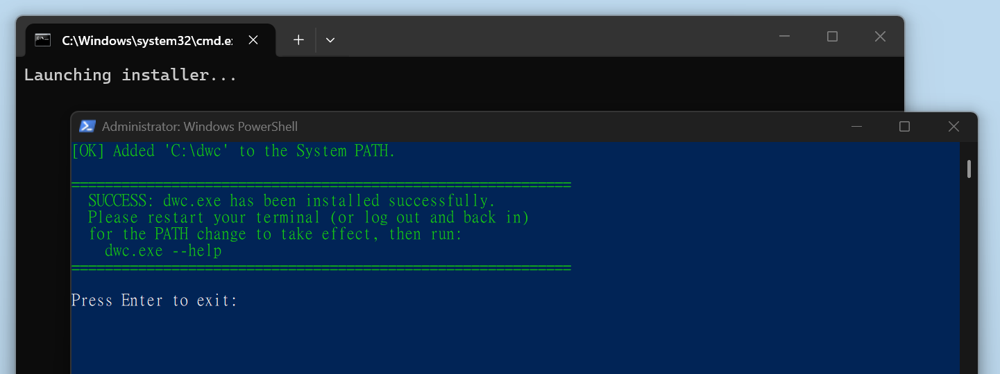
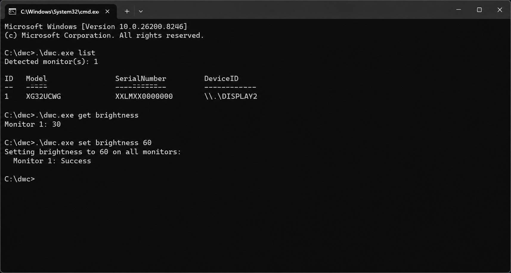

> 🌐 **语言**: [English](./README.md) · [繁體中文](./README.zh-TW.md) · **简体中文** · [日本語](./README.ja.md) · [한국어](./README.ko.md) · [Español](./README.es.md)

# 🖥️ ASUS Display Control

ASUS Display Control 提供查询和配置 ASUS 显示器设置的工具。
此存储库目前包含用于脚本和自动化的 [CLI](#-cli-快速入门) 工具，以及用于自然语言显示器控制的 AI [Agent Skill](#-ai-agent-skill)。

如果您偏好使用图形界面（GUI），可前往 ASUS 官方网站下载 [ASUS DisplayWidget Center](https://www.asus.com/content/monitor-software-osd-displaywidgetcenter/)。

## 📋 概述

| 目标用户 | 解决方案 | 功能说明 |
|---|---|---|
| 企业 IT 管理员 | [CLI](#-cli-快速入门) + IT 工具 | 远程脚本、部署、审计，以及跨企业工作站的标准化显示器配置。 |
| 开发者 | [CLI](#-cli-快速入门) + 脚本 | 通过命令提示符、PowerShell 或脚本进行显示器控制自动化。 |
| AI Agent 用户 | [CLI](#-cli-快速入门) + [Agent Skill](#-ai-agent-skill) | 通过 AI 助理以自然语言控制显示器。 |

## 🏢 企业 IT 管理

使用 ASUS Display Control CLI 进行远程 IT 管理，并跨企业工作站统一标准化显示器配置。

### 典型用例

- 配置亮度、颜色预设、输入源、电源行为或 OSD 相关设置。
- 运行启动脚本、计划任务或企业管理工作流。
- 审计显示器设置和功能，用于库存盘点、合规检查或故障排除。
- 在新部署、替换设备或整个部门间标准化显示器配置。

### 企业部署

- 对于大规模部署，ASUS Display Control CLI 可通过现有的企业端点管理基础设施进行分发和执行，例如 Microsoft Intune、Microsoft Configuration Manager（SCCM）、PowerShell Remoting、SSH 或类似的企业管理工具。
- 请注意，ASUS Display Control CLI 仅提供各工作站的本地显示器控制。

## 🚀 CLI 快速入门

### CLI 下载

| 平台 | 下载 | 可执行文件 |
| --- | --- | --- |
| Windows | [dwc.zip](https://github.com/ASUS-Display/asus-display-control/raw/main/cli/windows/dwc.zip) | `dwc.exe` |
| macOS | 即将推出 | `dwc` |

### CLI 安装

安装后即可在任何目录运行 CLI，无需指定完整路径。
安装脚本已包含在解压后的文件夹中。

| 平台 | 脚本 | 更新项目 |
| --- | --- | --- |
| Windows | `install.bat` | Windows 环境变量中的 `PATH` |
| macOS | `install.sh`（即将推出） | Shell 配置文件中的 `PATH` |

**注意**：安装后请勿移动或删除该文件夹——若文件夹被移动或删除，CLI 将无法正常运行。

### CLI 命令

打开**命令提示符**（Windows）或**终端**（macOS）并尝试以下命令：

| Windows | macOS | 说明 |
| --- | --- | --- |
| `dwc.exe help` | `dwc help` | 显示可用命令和语法 |
| `dwc.exe list` | `dwc list` | 列出所有已连接的 ASUS 显示器 |
| `dwc.exe info` | `dwc info` | 显示已连接显示器的详细信息 |
| `dwc.exe get brightness` | `dwc get brightness` | 读取当前亮度值 |
| `dwc.exe set brightness 60` | `dwc set brightness 60` | 将亮度设置为 60 |

如需命令语法、支持的属性及示例，请参阅 [CLI_REFERENCE.md](CLI_REFERENCE.md)。

## 🤖 AI Agent Skill

当您想让 AI 助理代为控制显示器，而无需手动输入命令时，请使用 Agent Skill。

示例请求：

- 💬「调低显示器 2 的亮度。」
- 💬「显示当前输入源。」
- 💬「将所有显示器的亮度设置为 50。」
- 💬「查看这台显示器支持哪些设置。」

Agent Skill 位于 [skills/asus-display-control/SKILL.md](skills/asus-display-control/SKILL.md)。请将其复制或引用至支持本地技能文件或自定义 Markdown 指令且可运行 Shell 命令的兼容 Agent 中。

### 兼容 Agent

- ✅ 任何支持自定义 Markdown 技能文件与 Shell 命令执行的 Agent。

## ⚙️ 系统要求

- Windows 10/11，或 macOS 12 及更高版本。
- 支持 DDC/CI 的 ASUS 显示器。
- 在显示器 OSD 菜单中启用 DDC/CI。
- 支持 DDC/CI 传输的显示连接，例如 DisplayPort 或 HDMI。

## 📚 文档

- [CLI 参考手册](CLI_REFERENCE.md)
- [AI Agent Skill](skills/asus-display-control/SKILL.md)
- [ASUS DisplayWidget Center](https://www.asus.com/content/monitor-software-osd-displaywidgetcenter/)

## 📄 许可证

本项目采用 Apache License 2.0 许可证。详情请参阅 [LICENSE](LICENSE)。
